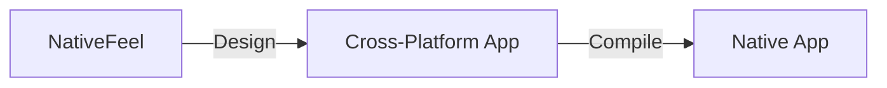

# NativeFeel
An Agent Skill for designing cross-platform desktop apps that feel native

## Problem Statement
Cross-platform desktop apps often lack the native feel of their platform-specific counterparts.

## Why it Matters
A native feel is essential for a seamless user experience.

## Architecture

## Project Structure
```
NativeFeel/
|---- src/
|       |---- core.py
|       |---- design.py
|       |---- compile.py
|---- main.py
|---- requirements.txt
|---- README.md
|---- CONTRIBUTING.md
```
## Installation
1. Clone the repository: `git clone https://github.com/your-username/NativeFeel.git`
2. Install the requirements: `pip install -r requirements.txt`
## Quick Start
1. Run the main script: `python main.py`
2. Follow the prompts to design and compile your cross-platform desktop app.
## Configuration
Configure the design and compile options in the `config.json` file.
## Design Decisions
* We chose a modular structure to facilitate maintenance and extension.
* We used a JSON configuration file for flexibility and ease of use.
## Roadmap
* Improve the design and compile processes
* Add support for more platforms
* Integrate with popular IDEs
## Contribution
See the [CONTRIBUTING.md](CONTRIBUTING.md) file for guidelines.
## License
This project is licensed under the MIT License.